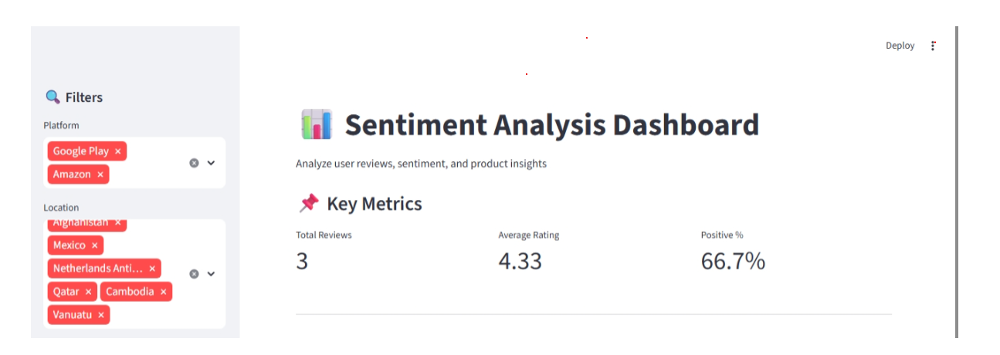
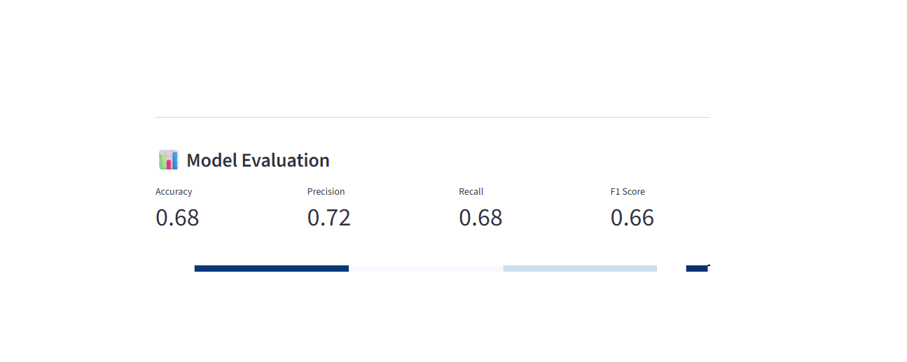
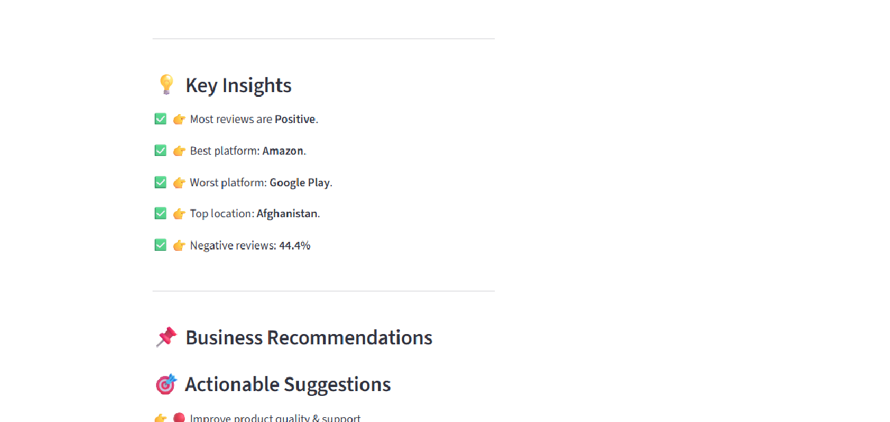

# Sentiment Analysis Dashboard – ChatGPT Reviews

## Project Overview
This project analyzes user reviews of ChatGPT to understand sentiment, user satisfaction, and product insights using NLP and machine learning.

## Features
- Sentiment classification (Positive / Neutral / Negative)
- Sentiment vs Rating mismatch analysis
- Platform-wise, location-wise, and version-wise insights
- Sentiment trends over time
- Verified vs non-verified user analysis
- Review length vs sentiment
- Negative feedback theme extraction
- Interactive Streamlit dashboard
- Real-time sentiment prediction for new reviews

## Tech Stack
- Python
- Pandas, NumPy
- Scikit-learn
- Sentence Transformers (MiniLM)
- Streamlit
- Plotly, Matplotlib

## How to Run
```bash
pip install -r requirements.txt
streamlit run app.py
# 📊 Sentiment Analysis Dashboard

An end-to-end NLP-powered dashboard that analyzes user reviews, predicts sentiment, and generates actionable business insights using Machine Learning and Streamlit.

---

## 🚀 Project Overview

This project focuses on analyzing customer reviews to understand sentiment trends and provide meaningful insights for decision-making.

It combines:

* Natural Language Processing (NLP)
* Machine Learning model predictions
* Interactive Streamlit dashboard
* Business insights & recommendations

---

## 🎯 Key Features

✅ Sentiment Prediction (Positive / Neutral / Negative)
✅ Interactive Dashboard with Filters (Platform, Location)
✅ Real-time User Input Prediction
✅ Model Evaluation (Accuracy, Precision, Recall, F1-score)
✅ Confusion Matrix Visualization
✅ Key Insights Generation
✅ Business Recommendations Engine

---

## 📸 Screenshots

### 🔹 Dashboard Overview



### 🔹 Sentiment Distribution


### 🔹 Model Evaluation



### 🔹 Insights & Recommendations



---

## 🧠 Tech Stack

* **Python**
* **Streamlit**
* **Scikit-learn**
* **Sentence-Transformers**
* **Pandas, NumPy**
* **Matplotlib, Seaborn, Plotly**

---

## ⚙️ How It Works

1. Load cleaned review dataset
2. Convert text into embeddings using SentenceTransformer
3. Predict sentiment using trained ML model
4. Visualize trends using charts
5. Evaluate model performance
6. Generate insights & business recommendations

---

## 📊 Model Evaluation

The model is evaluated using:

* Accuracy - 0.67
* Precision - 0.72
* Recall - 0.68
* F1 Score - 0.66
* Confusion Matrix

This ensures reliable sentiment classification performance.

---

## 💡 Key Insights

The dashboard automatically identifies:

* Most common sentiment trend
* Best and worst performing platforms
* Location-based satisfaction trends
* Percentage of negative feedback

---

## 📌 Business Recommendations

Based on analysis, the system suggests:

* Areas needing improvement
* Platform-specific performance issues
* Customer satisfaction strategies
* Retention & quality improvements

---

## 🎯 Impact

✔ Helps businesses understand customer feedback
✔ Enables data-driven decision making
✔ Identifies product/service issues quickly
✔ Improves customer satisfaction strategies

---

## 🧪 Run Locally

```bash
git clone <your-repo-link>
cd project-folder

python -m venv .venv
.\.venv\Scripts\activate

pip install -r requirements.txt

streamlit run app.py
```

---

## 📁 Project Structure

```
├── sentiment_app.py
├── sentiment_model.pkl
├── cleaned_reviews.csv
├── requirements.txt
├── README.md
```

---

## 🔮 Future Improvements

* Deploy on Streamlit Cloud / HuggingFace
* Add real-time API integration
* Enhance NLP model with deep learning
* Add multilingual sentiment support

---

## 👩‍💻 Author

**Priyadarshini**
Aspiring Data Scientist | Passionate about AI & NLP

---

⭐ If you found this project useful, consider giving it a star!
